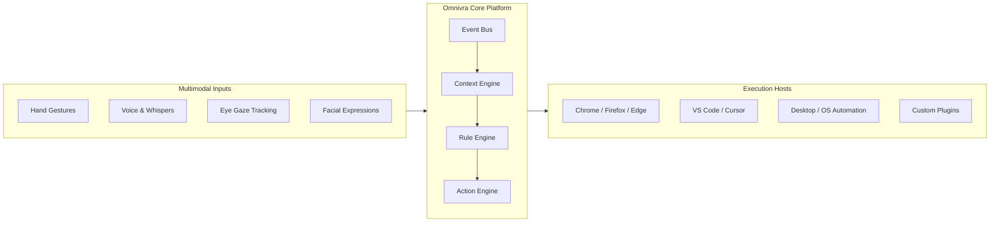

# Omnivra

<div align="center">

**Universal Multimodal Human-Computer Interaction Platform**

_ANY INPUT → ANY LOGIC → ANY ACTION_

[](https://github.com/akshaykumar33/Omnivra/actions/workflows/ci.yml)
[](LICENSE)
[](https://turbo.build/)
[](https://pnpm.io/)
[](tsconfig.base.json)

[Vision](docs/product/vision.md) • [Architecture](architecture/README.md) • [Quick Start](docs/getting-started.md) • [ADRs](architecture/adr/README.md) • [Roadmap](docs/product/roadmap.md) • [Contributing](CONTRIBUTING.md)

</div>

---

## 🌟 The Vision

Omnivra eliminates the barrier between biological human intention and software execution. It provides a universal, host-agnostic routing fabric where gestures, eye tracking, voice commands, and facial expressions translate into deterministic computer actions across browsers, IDEs, and native operating systems.



---

## ⚡ Core Interaction Examples

- **"Double blink to toggle YouTube playback"**: Without switching tabs or moving your mouse while coding.
- **"Raise two fingers to switch to the next editor split"**: Seamless split navigation in VS Code.
- **"Whisper 'Focus Mode' to silence notifications & open workspace"**: Context-aware workflow switching.
- **"Palm-up to raise playback volume on Spotify"**: Instant background media control.

---

## 🛡️ Radical Privacy & Security

- **Local-First Inference**: MediaPipe and speech recognition models execute 100% locally on your machine via WebAssembly, WebGPU, and ONNX Runtime.
- **Zero Video Leakage**: Camera frames and raw audio streams are never transmitted over the internet.
- **Capability-Based Permissions**: Plugins and actions require explicit capability declarations (e.g., `browser:tab.switch`, `media:playback.control`).

---

## 📂 Repository Structure

```
Omnivra/
├── .github/          # CI/CD workflows, issue templates, PR template
├── architecture/     # System context, component diagrams, and ADRs (0001-0010)
├── agents/           # 16 specialized AI engineering personas and boundaries
├── skills/           # 15 standardized development workflow skills (SKILL.md)
├── prompts/          # Reusable task prompts for AI coding agents
├── specs/            # Technical contracts for core engines, adapters, and modalities
├── phases/           # 16-phase roadmap (Phase 00 to Phase 15)
├── milestones/       # 40-milestone execution matrix (M00 to M39)
├── docs/             # Product, engineering, design, accessibility, and security docs
├── packages/         # Core TypeScript libraries (@omnivra/core, @omnivra/types, etc.)
├── apps/             # Target applications (Browser Extension, VS Code, Desktop, Dashboard)
└── plugins/          # Official integrations (YouTube, GitHub, Spotify)
```

---

## 🚀 Quick Start (Monorepo Development)

### Prerequisites

- **Node.js**: >= 24.0.0
- **pnpm**: >= 9.0.0

### Setup

```bash
# 1. Clone repository
git clone https://github.com/akshaykumar33/Omnivra.git
cd Omnivra

# 2. Install workspace dependencies
pnpm install

# 3. Build all packages and applications
pnpm turbo run build

# 4. Run automated test suites
pnpm turbo run test
```

---

## 🗺️ Execution Roadmap

Omnivra is currently in **Phase 01: Repository Foundation**.

Implementation proceeds sequentially through our 40 testable milestones:

1. **M00 — M02**: Discovery, Architecture & Monorepo Foundation _(Current)_
2. **M03 — M07**: Shared Domain Types, Logger, Event Bus & Local Persistence
3. **M08 — M11**: Rule & Action Engines, Browser Host Adapter
4. **M12 — M18**: Voice, Gesture, Eye Tracking & Facial Expression Engines
5. **M19 — M27**: VS Code Extension, AI Gateway, and Plugin SDK
6. **M28 — M34**: Tauri v2 Desktop Companion and E2EE Cloud Sync
7. **M35 — M39**: Hardening, WCAG 2.2 AA Compliance, and v1.0 Release

---

## 🤝 Contributing

Contributions, issues, and feature proposals are welcome! Please read [CONTRIBUTING.md](CONTRIBUTING.md) and our [Code of Conduct](CODE_OF_CONDUCT.md) before getting started.

---

## 📄 License

Omnivra is licensed under the [Apache 2.0 License](LICENSE).
Copyright © 2026 Omnivra Contributors.
