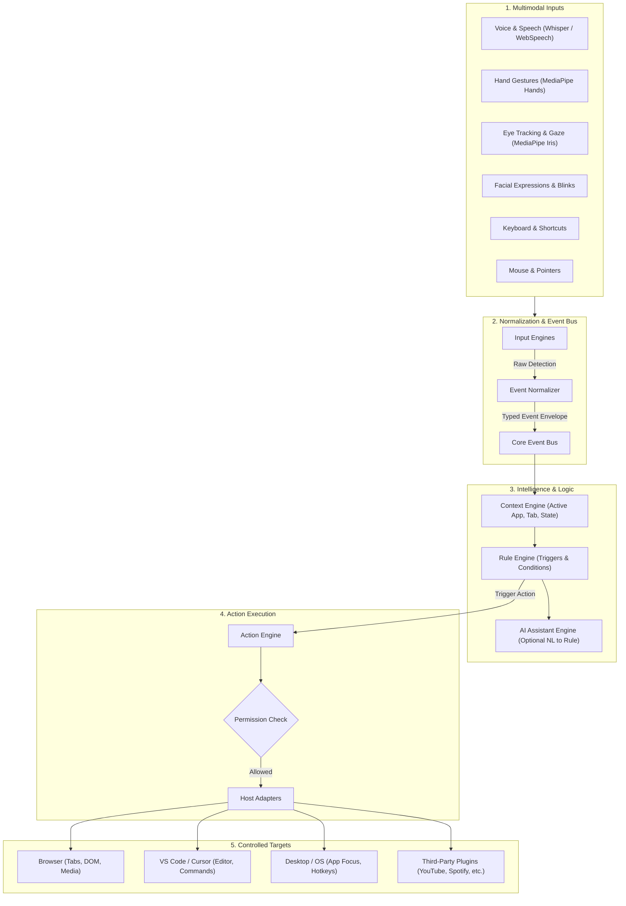

# Omnivra System Architecture

Omnivra is a universal multimodal Human-Computer Interaction (HCI) platform operating on the core invariant:
**ANY INPUT → ANY LOGIC → ANY ACTION**.

---

## 1. High-Level Concept Diagram

---

## 2. Architectural Pillars

1. **Host-Agnostic Core**: The core package (`@omnivra/core`) has zero dependency on browser extensions, VS Code APIs, or native OS kernels. It uses the Adapter pattern.
2. **Deterministic Event Bus**: All modalities emit normalized, strongly typed events across a pub/sub bus with strict backpressure and dead-letter handling.
3. **Local-First & Zero-Leak Privacy**: Vision and voice inference happen locally on the user's hardware. Raw camera and microphone frames never exit the local process.
4. **Capability-Based Permissions**: Actions require explicit capability grants (e.g. `browser:tab.switch`, `media:playback.toggle`, `os:app.launch`).
5. **Decoupled Plugin Ecosystem**: Plugins communicate strictly through public SDK contracts without reaching into core internals.

---

## 3. Architecture Documents Index

* [System Context](system-context.md) — External actors, boundary definitions, and environment bindings.
* [System Architecture](system-architecture.md) — System layers, Clean Architecture, and subsystem interactions.
* [Component Architecture](component-architecture.md) — Monorepo packages, modules, and public APIs.
* [Runtime Architecture](runtime-architecture.md) — Process models, web workers, IPC channels, and lifecycle.
* [Multimodal Pipeline](multimodal-pipeline.md) — End-to-end signal processing and inference budgets.
* [Event Architecture](event-architecture.md) — Event schemas, deduplication, prioritization, and throttling.
* [Plugin Architecture](plugin-architecture.md) — Plugin manifests, sandboxing, triggers, and action definitions.
* [Security Architecture](security-architecture.md) — Threat model, capability-based security, and sandboxing.
* [Data Architecture](data-architecture.md) — Local persistence, SQLite/IndexedDB schema, and migration strategy.
* [Sync Architecture](sync-architecture.md) — Conflict-free replicated rules, device pairing, and cloud telemetry.
* [Host Architectures](browser-architecture.md) — Browser, VS Code, and Desktop runtime implementations.
* [Architectural Decision Records (ADRs)](adr/README.md) — Numbered rationale records (ADR 0001 - 0010).
