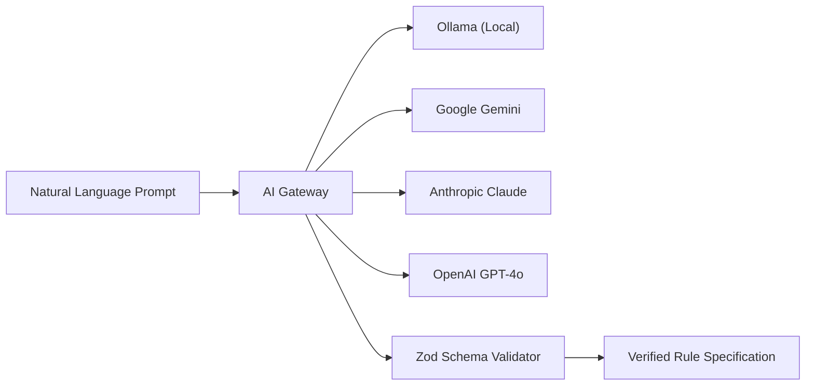

# AI Architecture & Provider Gateway

Omnivra abstracts AI providers behind a unified, vendor-neutral gateway.

## Invariant: Safe Rule Generation

The AI engine NEVER directly invokes system calls. It only yields verified JSON rule declarations conforming to the `RuleSchema` specification.
