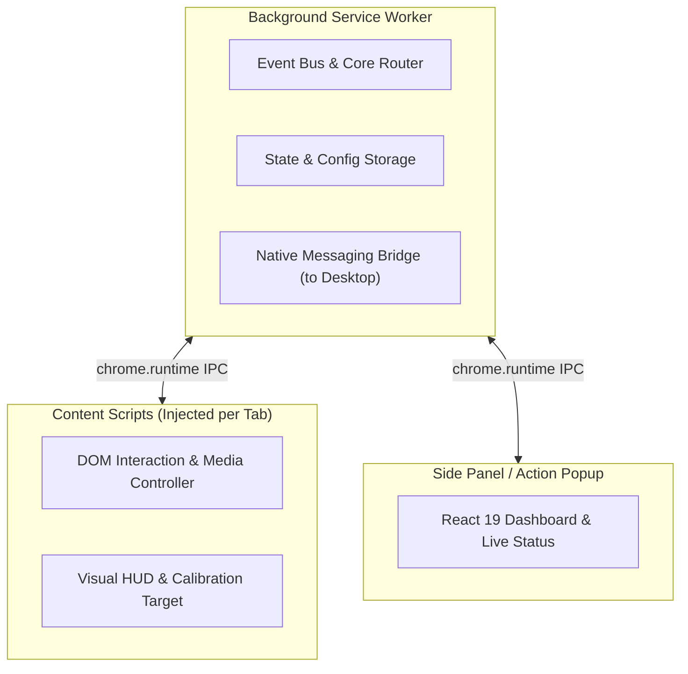

# Browser Extension Architecture

Omnivra's browser client is built on modern WebExtension standards (Manifest V3) using WXT.

```mermaid
graph TD
    subgraph Background ["Background Service Worker"]
        BkgEngine["Event Bus & Core Router"]
        BkgStorage["State & Config Storage"]
        NativeBridge["Native Messaging Bridge (to Desktop)"]
    end

    subgraph ContentScript ["Content Scripts (Injected per Tab)"]
        DOMAdapter["DOM Interaction & Media Controller"]
        VisionOverlay["Visual HUD & Calibration Target"]
    end

    subgraph SidePanel ["Side Panel / Action Popup"]
        UI["React 19 Dashboard & Live Status"]
    end

    Background <-->|chrome.runtime IPC| ContentScript
    Background <-->|chrome.runtime IPC| SidePanel
```
