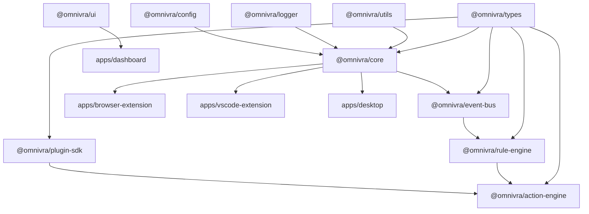

# Component Architecture & Monorepo Boundaries

Omnivra packages adhere strictly to unidirectional dependency boundaries:

```mermaid
graph TD
    types["@omnivra/types"]
    utils["@omnivra/utils"]
    logger["@omnivra/logger"]
    config["@omnivra/config"]
    
    core["@omnivra/core"]
    bus["@omnivra/event-bus"]
    rule["@omnivra/rule-engine"]
    action["@omnivra/action-engine"]
    plugin_sdk["@omnivra/plugin-sdk"]
    ui["@omnivra/ui"]

    apps_browser["apps/browser-extension"]
    apps_vscode["apps/vscode-extension"]
    apps_desktop["apps/desktop"]
    apps_dashboard["apps/dashboard"]

    types --> core
    types --> bus
    types --> rule
    types --> action
    types --> plugin_sdk

    utils --> core
    logger --> core
    config --> core

    core --> bus
    bus --> rule
    rule --> action
    plugin_sdk --> action

    core --> apps_browser
    core --> apps_vscode
    core --> apps_desktop
    ui --> apps_dashboard
```
