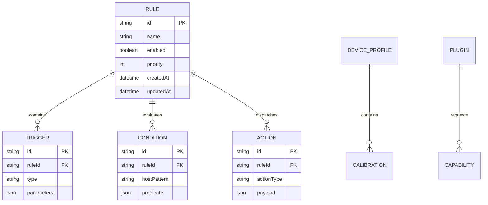

# Data Architecture & Storage Strategy

Omnivra stores configuration, rules, calibration profiles, and telemetry locally.

## Storage Engines

- **Browser Extension**: `chrome.storage.local` for configuration; IndexedDB for offline model weights and cached rules.
- **VS Code / Desktop**: SQLite (via `better-sqlite3` / Tauri SQL) for rapid rule lookups and persistent profile vectors.
