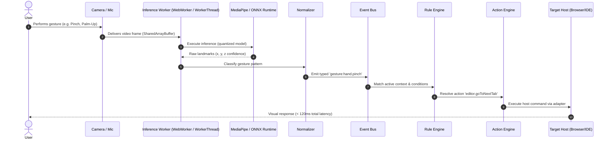

# Multimodal Pipeline & Recognition Lifecycle

Omnivra processes concurrent visual, audio, and physical signals through a synchronized, low-latency pipeline.

## Latency Budgets & Sampling
* **Camera Capture**: 30 FPS input, throttled inference (15-20 FPS) to conserve CPU/battery.
* **Inference Budget**: ≤ 25ms per frame on standard integrated GPUs via WebGL/WebGPU.
* **Event Dispatch & Rule Match**: ≤ 5ms.
* **Action Dispatch**: ≤ 15ms.
* **End-to-End Latency Target**: ≤ 120ms from physical gesture to visual feedback.
