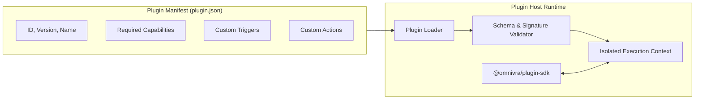

# Plugin Architecture & Sandboxing

Omnivra provides an open plugin model allowing third-party developers to contribute triggers, conditions, and actions without modifying the core.



## Example Plugin Definition (`@omnivra/plugin-sdk`)

```typescript
import { definePlugin } from "@omnivra/plugin-sdk";

export default definePlugin({
  id: "omnivra-plugin-youtube",
  version: "1.0.0",
  name: "YouTube Multimodal Control",
  permissions: ["media:playback.control", "browser:dom.query"],
  triggers: [
    {
      id: "youtube:video.buffering",
      name: "Video Buffering",
      schema: { type: "object" },
    },
  ],
  actions: [
    {
      id: "youtube:volume.set",
      name: "Set YouTube Volume",
      handler: async (ctx, payload) => {
        await ctx.host.browser.executeScript(
          `document.querySelector('video').volume = ${payload.level};`,
        );
      },
    },
  ],
  setup: async (ctx) => {
    ctx.logger.info("YouTube plugin initialized successfully");
  },
});
```
