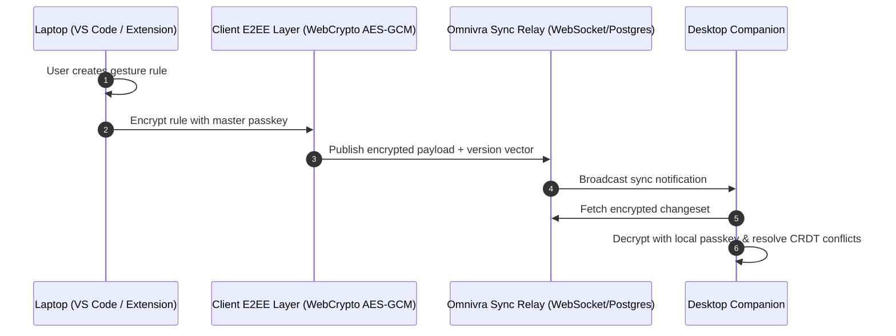

# Cloud Sync & Multi-Device Architecture

Omnivra rules and user preference profiles synchronize seamlessly across devices while preserving end-to-end encryption (E2EE).

## Invariants

- Sync Relay never receives plaintext rule descriptions or configuration values.
- CRDT-based conflict resolution ensures offline edits merge deterministically.
