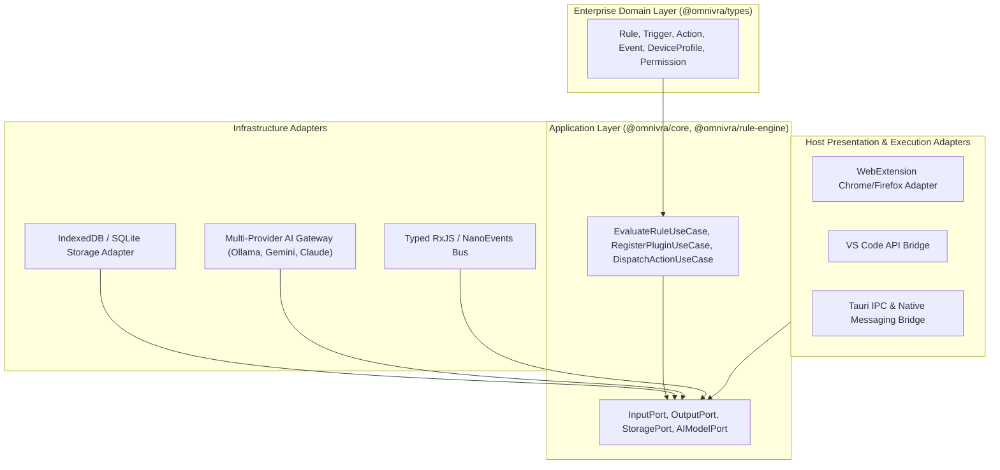

# System Architecture

Omnivra follows Clean Architecture and Domain-Driven Design (DDD) to preserve host portability.

## Architectural Invariants

- The domain core has zero external framework dependencies.
- All input modalities communicate through normalized `InputEvent` structures.
- Handlers never directly invoke external APIs; all external interactions pass through capability-checked `HostAdapter` instances.
