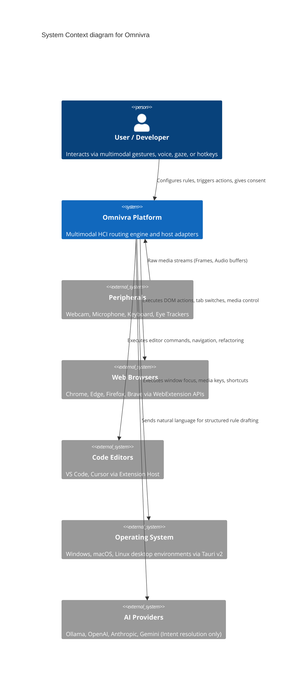

# System Context & Boundaries

Describes the external actors, devices, hardware peripherals, and target applications that interact with Omnivra.

## Process & Trust Boundaries

1. **Device Sensor Boundary**: Microphone and camera feeds reside strictly in high-isolation worker threads.
2. **Plugin Sandbox Boundary**: External plugins run within an isolated context with restricted globals.
3. **Network Boundary**: Zero telemetry or rule data leaves the machine unless cloud sync is explicitly enabled with end-to-end encryption.
