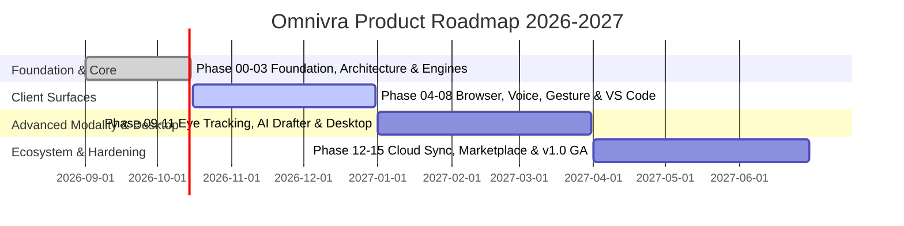

# Strategic Product Roadmap

## Milestones Summary

- **Q4 2026**: Alpha Release — Local gesture + voice controlling Chrome and VS Code.
- **Q1 2027**: Beta Release — Eye tracking, facial micro-expressions, Tauri v2 desktop companion.
- **Q2 2027**: v1.0 General Availability — Plugin marketplace, end-to-end encrypted rule sync, WCAG 2.2 AA certification.
